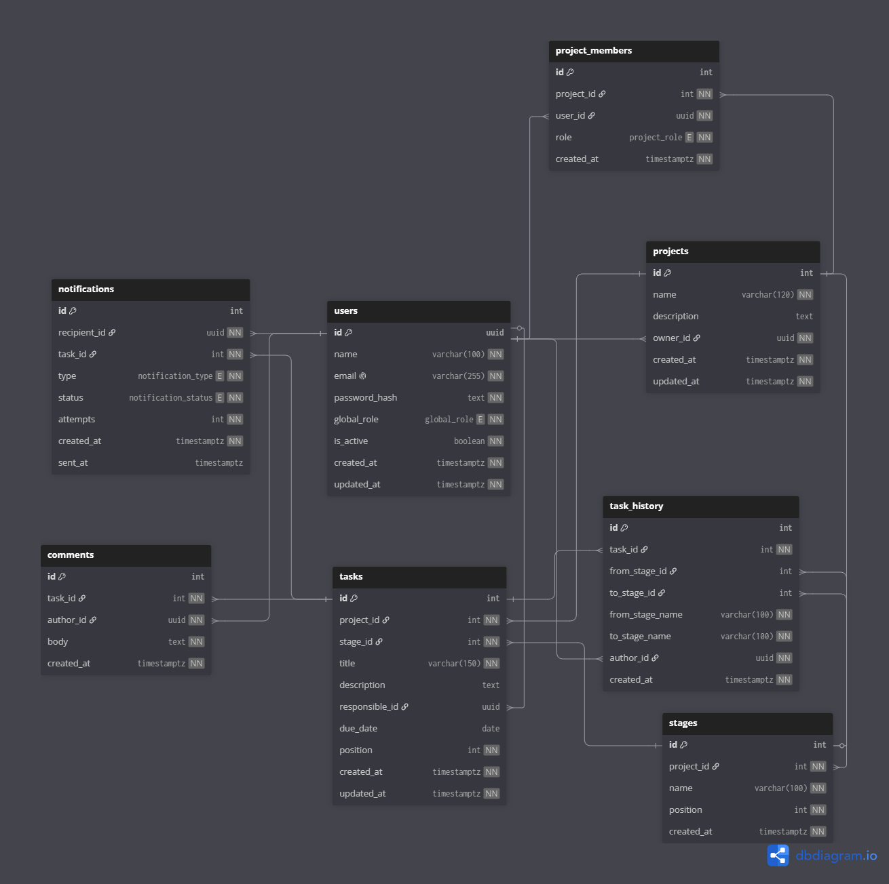

# 🔺Delta
Gerenciador de tarefas ágil baseado no modelo Kanban.

<p> 
<a href="#escopo">Escopo</a> | 
<a href="#diagrama">Diagrama</a> | 
<a href="#tecnologias">Tecnologias</a> | 
<a href="#requisitos">Requisitos</a> | 
<a href="#estrutura">Estrutura</a> | 
<a href="#rodar">Como rodar</a> | 
<a href="#comandos">Comandos</a> |
<a href="#creditos">Créditos</a> 
</p>

---

## 📋 Escopo
<a id="escopo"></a>
🚧 Em desenvolvimento...

## 🖋️ Diagrama
<a id="diagrama"></a>

Diagrama de entidade-relacionamento do banco de dados (gerado no [dbdiagram.io](https://dbdiagram.io) a partir de [`docs/diagrama.dbml`](docs/diagrama.dbml)):

<div align="center">



</div>


## 🛠️ Tecnologias
<a id="tecnologias"></a>
<div align="center">


</div>

## 🔎 Requisitos
<a id="requisitos"></a>
- Python 3.12+
- PostgreSQL (configurável via `.env` — veja `.env.example`)


## 📦 Estrutura do Repositório
<a id="estrutura"></a>
🚧 Em desenvolvimento...

<!---
```bash
delta-tasks/
├── docs/
│   └── backlog.md               # Documentação com aprendizados e conceitos do sistema
│
├── .gitignore                    # Arquivos ignorados pelo Git
└── README.md                     # Documentação principal do projeto
```
---->


## ⚙️ Como rodar o projeto?
<a id="rodar"></a>

Há dois caminhos equivalentes. Use **poetry** se já o tem instalado; senão use **pip + venv**.

### 🐍 Opção A: pip + venv

```bash
python -m venv venv
source venv/bin/activate          # Windows: venv\Scripts\activate
pip install -r requirements.txt   # runtime apenas
# ou, para desenvolver (inclui ruff, mypy, pytest, etc.):
pip install -r requirements-dev.txt

python run.py                     # sobe a API em http://127.0.0.1:8000 (reload)
```

### 📦 Opção B: Poetry

```bash
make install        # poetry install
make dev            # uvicorn com --reload
```

## 🖥️ Comandos úteis (Makefile)
<a id="comandos"></a>

| Comando                | Descrição                                         |
| ---------------------- | ------------------------------------------------- |
| `make dev`             | Sobe a API com reload                             |
| `make test`            | Roda os testes (pytest)                           |
| `make lint`            | ruff check + bandit                               |
| `make format`          | ruff format                                       |
| `make typecheck`       | mypy (modo estrito)                               |
| `make migrate`         | Aplica as migrations (alembic upgrade head)       |
| `make install-pip`     | Instala dependências de runtime via pip           |
| `make install-pip-dev` | Instala runtime + ferramentas de dev via pip      |
| `make requirements`    | Regera `requirements*.txt` a partir do poetry.lock |

> Os arquivos `requirements.txt` e `requirements-dev.txt` são **gerados** a partir do `poetry.lock`.
> Após alterar dependências no `pyproject.toml`, rode `make requirements` para mantê-los em sincronia.


## 👥 Créditos
<a id="creditos"></a>
<div align="center">

| Nome              | Perfil no GitHub                                                                                                                           |
| ----------------- | ------------------------------------------------------------------------------------------------------------------------------------------ |
| Raphaela Monteiro | [](https://github.com/raphaelamonteiro) |
| Julia Pereira     | [](https://github.com/juliasoares17)    |
| Pedro Garcia      | [](https://github.com/pedro-fs-garcia)  |

</div>
